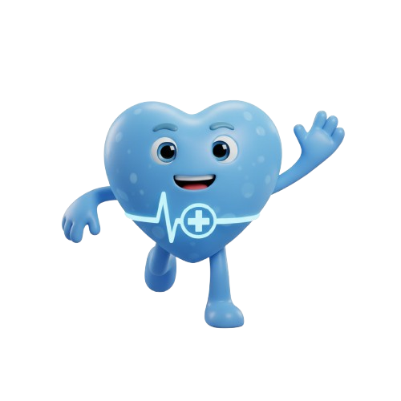

# Jornada do Cuidado — Challenge Care Plus (FIAP)

  

## Objetivo do Projeto

Este projeto foi desenvolvido como parte do **Challenge FIAP**, em parceria com a **Care Plus**. O grande objetivo da proposta é criar uma solução digital inovadora que reduza a taxa de _no-show_ nas clínicas médicas, engaje os clientes e promova uma cultura contínua de responsabilidade e cuidado com a própria saúde. Utilizando conceitos de **design comportamental e gamificação**, transformamos o comparecimento às consultas em uma experiência ativa, motivadora e recompensadora.

---

## Estrutura de Desenvolvimento: Da Concepção ao Código

O projeto foi dividido metodologicamente em duas etapas principais:

- **Sprint 1 (Base e Conceito):** Foco na ideação do modelo de negócio e construção do protótipo das interfaces utilizando o **Figma**.
- **Sprint 2 (Da Teoria ao Código):** Transição e refinamento técnico focado em desenvolvimento de _front-end_. O que era estático no Figma foi transformado em código real, responsivo, interativo e limpo, visando uma entrega fluida e de alta usabilidade.

---

## Os 4 Pilares do Engajamento

Nossa arquitetura de informação e funcionalidades foi construída ao redor de quatro pilares estratégicos:

1. **Pilar 1: Gamificação e Recompensa ("Care Coins"):** Cada ação positiva realizada pelo paciente (como confirmar consultas com antecedência ou realizar exames solicitados) gera _Care Coins_, moedas virtuais que podem ser trocadas por benefícios exclusivos em um catálogo integrado.
2. **Pilar 2: Conexão Emocional (O Mascote Care):** Criação de um companheiro virtual (o coração herói da Care Plus) presente em alertas e modais humanizando as notificações com um tom de voz carismático.
3. **Pilar 3: Antecipação de Obstáculos (Mobilidade Assistida):** Sistema de notificações inteligentes que analisa dados de clima e trânsito em tempo real, mitigando problemas logísticos de deslocamento que causam o atraso ou o _no-show_.
4. **Pilar 4: Conveniência e Integração (Ferramentas Digitais):** Remoção de atritos diários permitindo sincronização da consulta com o calendário nativo do smartphone e mapas de estacionamentos parceiros ao redor da clínica.

---

## Tecnologias Utilizadas

Conforme requisito do trabalho, o projeto foi codificado com as seguintes tecnologias:

- **HTML5**
- **CSS3**
- **JavaScript (ES6+)**
- **Bootstrap 5**

---

## Arquitetura do Repositório e Fluxo de Telas

O ecossistema de arquivos do projeto está estruturado de forma modular para fácil manutenção:

- `index.html` (Tela de Login): Porta de entrada da plataforma, simulando o acesso seguro da usuária Mariana ao ambiente.
- `dashboard.html` (Home / Tela Inicial): Painel unificado que exibe o resumo do progresso, saldo de moedas virtuais, monitor de hábitos saudáveis e o controle de agendamentos pendentes com gatilhos de confirmação.
- `beneficios_careplus.html` (Tela de Benefícios): Catálogo interativo que possibilita o resgate de mimos (como vouchers, massagens e kits de saúde) utilizando o saldo acumulado de _Care Coins_.
- `conquistas.html` (Tela de Níveis): Visualização da evolução de nível do paciente (Bronze, Prata, Ouro e Platinum) e quadro completo de medalhas conquistadas.

---
